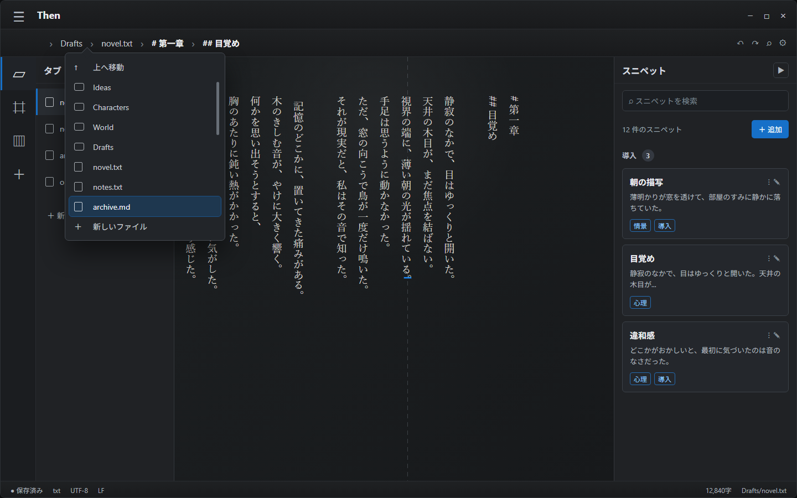

# Then

> **縦書きで書きたい。**

Thenは、日本語の小説やシナリオを書くためのWindowsデスクトップエディタです。

原稿を書き、構成を組み、資料を参照し、文章を校正して、PDFやDOCXへ書き出せます。原稿は通常のMarkdownまたはテキストファイルとして保存されます。

[最新版をダウンロード](https://github.com/maybefix/Then/releases/latest) ・
[操作マニュアル](docs/USER_MANUAL.md) ・
[変更履歴](https://github.com/maybefix/Then/releases)

- 対応環境: Windows x64
- 配布形式: NSISインストーラー
- 技術構成: Tauri v2 / React / TypeScript / Vite / Tiptap



## 主な機能

### 本文を書く

- 縦書き／横書き
- タイプライタースクロール
- 見出し、引用、リスト、太字
- ルビ、圏点、縦中横、行揃え
- 行番号、現在行ハイライト、会話文の色分け
- タブごとのカーソル位置と表示位置の復元
- コマンドパレット

### 構成を組む

- Ideaの保存、検索、並べ替え
- 章とセクションをカードで整理するPlot
- Ideaや資料を自由に配置するIdea Board
- カード同士を結ぶ線、矢印、ラベル
- カードを縦にまとめるスレッド
- 複数Boardの作成、並べ替え、削除・復元

Canvas上のテキストカードは、順番を整えて一つの中間稿にできます。再生成前の文章も版として残り、プレーンテキストへ書き出せます。

### 資料を参照する

- テキスト、Markdown、画像、PDFの登録
- プロジェクト専用資料と共通資料
- 検索、プレビュー、コピー、移転
- 本文の上に重ねられる資料カード
- Idea Boardへの資料配置

### 文章を確かめる

- 13種類の日本語校正ルール
- 表記のゆれ、重複表現、冗長表現
- 約物、敬語、話し言葉
- 異字同訓、同音異義語、主述の対応
- 固有名詞や作中用語を登録する校正辞書
- 指摘箇所へのジャンプと置換候補

校正はアプリ内で完結します。原稿を外部の解析サービスへ送信しません。

### 保存点を残す

- プロジェクト全体のチェックポイント
- 現在の原稿と保存点の比較
- 保存点同士の比較
- プロジェクト全体または一部だけの復元
- 復元前の自動退避

### PDF・DOCXへ書き出す

複数の原稿ファイルを好きな順番で束ね、一つの文書にできます。

- PDF / DOCX
- B6、A5、A6、B5、A4、カスタムサイズ
- 縦書き、段組み、余白、本文フォント
- ヘッダー、フッター、ノンブル
- 実際の出力結果に沿ったプレビュー

## インストール

[GitHub Releases](https://github.com/maybefix/Then/releases/latest)から、最新版のWindowsインストーラーをダウンロードしてください。

```text
Then_*_x64-setup.exe
```

ThenはNSIS形式のインストーラーを配布しています。

現在のインストーラーはコード署名されていないため、Windows SmartScreenが警告を表示する場合があります。必ずこのリポジトリのGitHub Releasesから取得してください。

## はじめかた

1. Thenを起動します。
2. 原稿を保存するフォルダを選びます。
3. `.md` または `.txt` ファイルを作成します。
4. 本文、Idea、Plot、Canvasを行き来しながら執筆します。
5. 必要に応じてチェックポイントやPDF / DOCX出力を使います。

詳しい操作は[ユーザーマニュアル](docs/USER_MANUAL.md)を参照してください。

## データの保存

原稿はワークスペース内の `.md` / `.txt` ファイルとして保存されます。

Idea、Plot、ファイルの並び順などは `.then/project.json`、Idea Boardや登録した資料は `.then` ディレクトリ以下に保存されます。

`.then` はThenが管理するディレクトリです。通常は直接編集せず、アプリから操作してください。

## プラグイン

Then Plugin API v1対応プラグインを導入できます。

プラグインは、右ツールビュー、作業画面、モーダル、選択時のコマンド、ステータスバー項目などを追加できます。

- [Plugin API v1](docs/PLUGIN_API_V1.md)
- [Selection Notesサンプル](docs/plugin-example/)
- [Ticketサンプル](docs/ticket/)

## 開発

必要なもの:

- Node.js / npm
- Rust
- Tauri v2のWindows向け前提ツール

```powershell
npm install
npm run tauri:dev
```

ブラウザでUIだけを確認する場合:

```powershell
npm run dev:local
```

ビルドと検証:

```powershell
npm run build
npm run test:v064-canvas
npm run test:performance
npm run test:heading-move
npm run test:heading-dnd-ui
npm run test:export
npm run tauri:build
```

NSISインストーラーは次の場所に生成されます。

```text
src-tauri/target/release/bundle/nsis/
```

## ドキュメント

- [ユーザーマニュアル](docs/USER_MANUAL.md)
- [Plugin API v1](docs/PLUGIN_API_V1.md)
- [原稿ASTの管理方針](docs/AST_MANAGEMENT_POLICY.md)
- [縦書きエディタの設計資料](docs/VERTICAL_EDITOR_ARCHITECTURE_REBOOT.md)
- [リリースチェックリスト](docs/RELEASE_CHECKLIST.md)

## Vivliostyleと第三者ライセンス

ThenはPDFのページ組版にVivliostyle Viewer 2.43.3を使用しています。組版はローカルで実行され、原稿を外部サーバーへ送信しません。

- [第三者ライセンス告知](THIRD_PARTY_LICENSES/Vivliostyle-NOTICE.md)
- [AGPL-3.0全文](THIRD_PARTY_LICENSES/AGPL-3.0.txt)
- [Vivliostyle公式ライセンスFAQ](https://vivliostyle.org/ja/faq/#vivliostyle-license-faq)
- [同梱版に対応するソースコード](https://github.com/vivliostyle/vivliostyle.js/tree/74048579bd3dde59a7a814bca6e9fd11760c6059)
