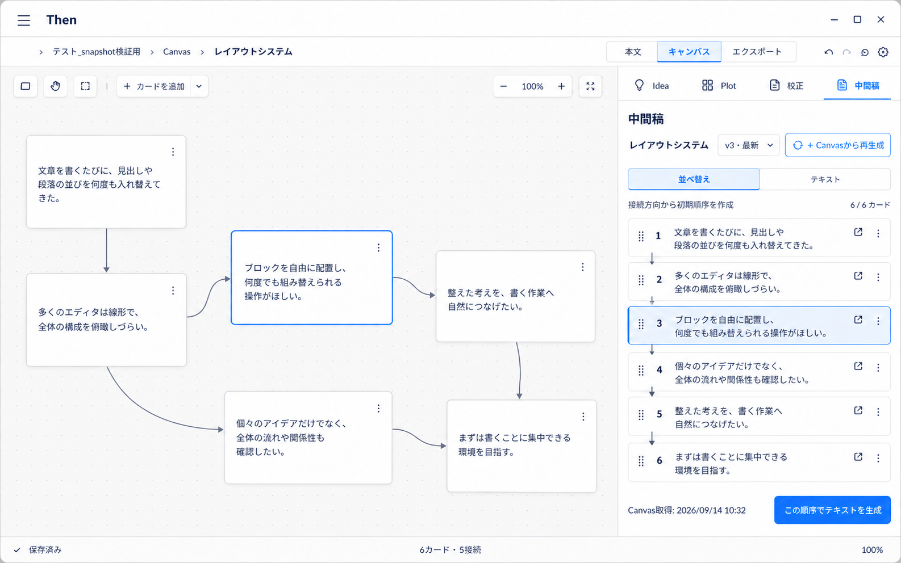
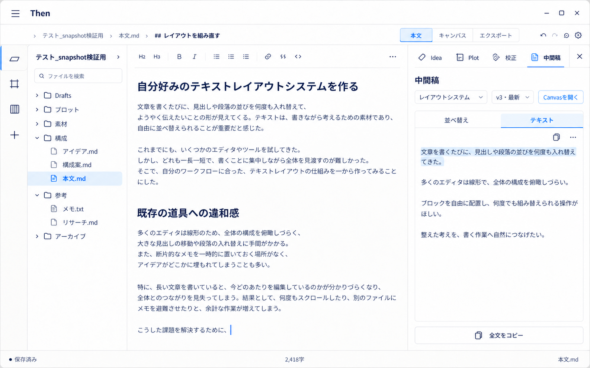

# Canvas 中間稿：要件と画面設計

作成日: 2026-09-14
状態: 設計合意済み・未実装

## 1. 目的

Canvas 上で自由配置した文章断片を、本文を書く前に線形な文章へ組み直せるようにする。

既存の「プロットへ送る」「チケット化する」とは異なり、Canvas カードにすでに書かれている文章を生かしながら、順序の整理と文章の書き直しを行う。その成果物を本文執筆中に参照し、必要な箇所をコピー＆ペーストして使う。

## 2. 用語

この機能の成果物を **中間稿** と呼ぶ。

検討初期には「構成稿」と呼んでいたが、完成原稿ではなく、Canvas と本文の間で文章を組み直す稿であることを明確にするため「中間稿」に変更した。

## 3. 現行 Canvas カードの前提

通常の Canvas テキストカードは、独立した見出しやタイトルを持たない。

```ts
type CanvasTextNode = {
  id: string;
  type: "text";
  x: number;
  y: number;
  width: number;
  height: number;
  text: string;
  // 表示設定など
};
```

- 通常カードの文章フィールドは `text` 一つだけである。
- 新規カードは空の `text` から作られる。
- UI もカード本文用の `textarea` 一つであり、タイトル入力欄はない。
- `label` を持つグループ、`name` を持つ資料カードは通常のテキストカードとは別種である。
- 本文の1行目を暗黙の見出しとして扱わない。

したがって、中間稿の並べ替え UI は見出しやカード名を前提にできない。各カードは、安定したカード ID を内部識別子とし、画面上では **順序番号と本文抜粋** で識別する。

## 4. 所属と生成範囲

- 現時点では **一つのボードに一つの中間稿** とする。
- ワンテーマ・ワンボードを基本とする。
- 目的が異なる場合は別のボードを使う。
- 派生稿や一つのボードに複数の中間稿を持つ要件は、将来の検討課題とする。
- 中間稿はボード全体から作る。一部カードをチェックして生成対象を選ぶ方式にはしない。
- 生成対象となる Canvas テキストカードをすべて並べ替え画面へ出す。
- カード間に接続がある場合は、接続方向を初期順序の決定に利用する。
- 接続だけでは一意に決められない分岐、合流、未接続、循環などは、並べ替え画面で人が確定する。

## 5. 中間稿の実体

中間稿の最終的な実体は、他のテキストエディタでも読める連続したプレーンテキストとする。

順序付きカードやアウトラインに近い表現は生成過程で使用してよいが、それ自体を最終成果物にはしない。

中間稿は少なくとも次の情報を保持する必要がある。

- 所属する Canvas ボード
- 元にした Canvas の取得時点
- 取得したカードの ID と、その時点の本文スナップショット
- 確定したカード順
- 生成後に編集されたプレーンテキスト
- バージョン番号と作成・更新日時

具体的な保存形式、ファイル配置、スキーマは実装時に決定する。

## 6. 一方向の更新とバージョン管理

Canvas が原本であり、中間稿は生成時点のスナップショットである。

```text
Canvas の現在状態
        ↓ キャプチャ／再生成
中間稿の新バージョン
        ↓ 人が文章を編集
そのバージョン固有のプレーンテキスト
```

- 中間稿で文章を編集しても Canvas カードへ逆同期しない。
- Canvas カードを変更しても、既存の中間稿を自動更新しない。
- Canvas の変更を反映したい場合は、Canvas から中間稿を再生成する。
- 再生成は既存バージョンを上書きせず、新しいバージョンを作る。
- 旧版の中間稿で行った文章編集を、新版へ自動的に取り込まない。
- 旧版は過去の考えを参照するために残す。
- 必要な文言が旧版にある場合は、見比べたうえで人がコピーする。

中間稿の文章編集を Canvas の変更へ機械的に対応付けて新版へ統合することは想定しない。

## 7. 右サイドバー

中間稿を作成・編集・参照する場所は右サイドバーとする。

同じ中間稿サイドバーを、次の両方で使用する。

1. Canvas を表示しているとき
2. 本文を表示しているとき

サイドバーには、少なくとも次の二つのタブを置く。

### 7.1 並べ替え

- ボード全体のテキストカードを一列に表示する。
- 各行は順序番号、ドラッグハンドル、本文抜粋で構成する。
- カードタイトルや見出しは表示しない。
- 接続方向から作った初期順序を提示する。
- ドラッグ操作で人が最終順序を決める。
- Canvas 上で選択したカードと、並べ替え行の選択を対応させる。
- 確定した順序からプレーンテキストを生成する。

### 7.2 テキスト

- 生成された中間稿を、連続したプレーンテキストとして表示する。
- カードごとの箱やタイトルを残さない。
- 文言の修正、段落の編集、文章の書き直しを可能にする。
- テキスト選択と通常のコピーを可能にする。
- 全文コピーを補助操作として用意してよい。

### 7.3 共通操作

- 所属ボード名の表示
- バージョンの選択と過去版の参照
- Canvas からの再生成（新バージョン作成）
- Canvas を開く導線
- 保存状態と Canvas 取得時点の表示

## 8. 本文との関係

本文へ移す基本操作はコピー＆ペーストとする。

- 中間稿全体をそのまま本文へ投入することを主目的にしない。
- 本文を書きながら右サイドバーの中間稿を読む。
- 使える文言を必要に応じて選択し、本文へコピー＆ペーストする。
- 「本文へ反映」「カーソル位置へ挿入」などの強い自動転記 UI は、この設計の中心に置かない。
- 中間稿は本文の完成形ではなく、本文を書くための参照可能な中間成果物である。

## 9. タイプライタースクロールとの共存

本文エディタと中間稿を二つの主編集面として横並びにする比較編集モードは採用しない。

- 本文エディタは従来どおり中央の唯一の主編集面とする。
- 本文のタイプライタースクロールを維持する。
- 中間稿は既存の右サイドバー領域に表示する。
- 中間稿側のスクロールは右サイドバー内で独立させる。
- 本文のキャレット追従やスクロール位置と、中間稿の表示位置を同期しない。

## 10. 画面モックアップ

### Canvas 表示＋並べ替え



- Canvas カードは自由配置のまま表示する。
- 右サイドバーでは全カードを順序番号と本文抜粋で並べる。
- 見出しやタイトルは前提にしない。

### 本文表示＋中間稿テキスト



- 本文エディタのタイプライタースクロールを維持する。
- 中間稿は右サイドバーでプレーンテキストとして編集・参照する。
- 本文への移動はコピー＆ペーストを基本とする。

モックアップは構造と役割を確認するためのものであり、表示文言、アイコン、寸法の最終仕様ではない。

## 11. 実装前に詰める事項

次の項目は今回の会話では確定していない。

- 空のテキストカードを生成対象に含めるか
- グループのラベルや資料カードを中間稿生成へどう関与させるか
- `line`、`arrow`、`bidirectional`、`dashed` の各接続種別を初期順序へどう反映するか
- 分岐、合流、循環、未接続カードの初期整列規則
- カード間へ挿入する改行数や区切り文字
- テキスト編集開始後に並べ替えを変更した場合の扱い
- プレーンテキストとバージョン情報の保存形式・保存場所
- バージョンの削除、複製、名称付けの要否
- Global Canvas の中間稿を、プロジェクト本文から参照する場合の導線

## 12. 関連する完了済み修正

Canvas から特定の Idea 断片を表示した後、Idea ペインを開き直すたびに同じ断片へジャンプする不具合を修正した。

原因は、Canvas 由来のフォーカス要求が処理後も親コンポーネントに残り、Idea ペインの再マウント時に再実行されていたことだった。フォーカス要求を一度消費した時点で破棄する一回限りのイベントとして扱うように変更した。
