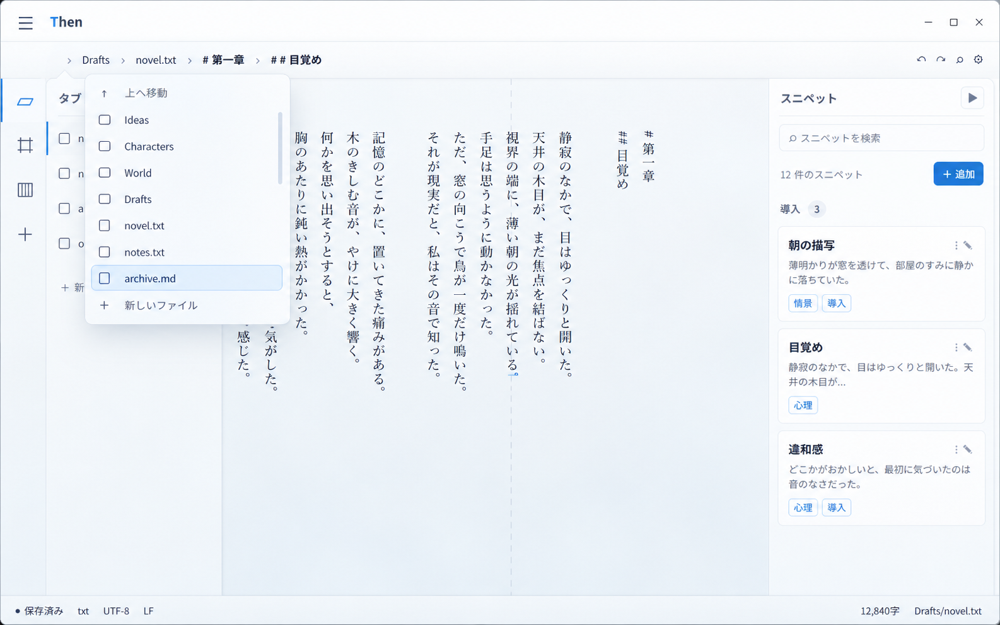
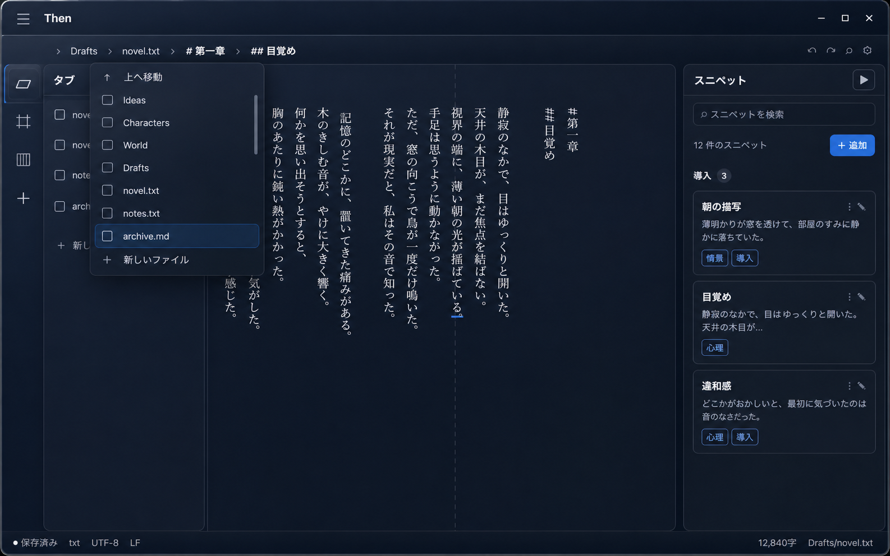
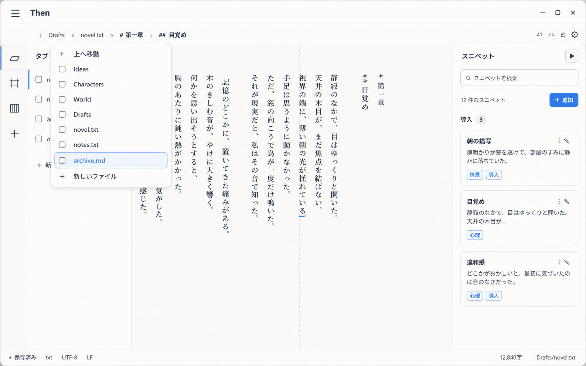
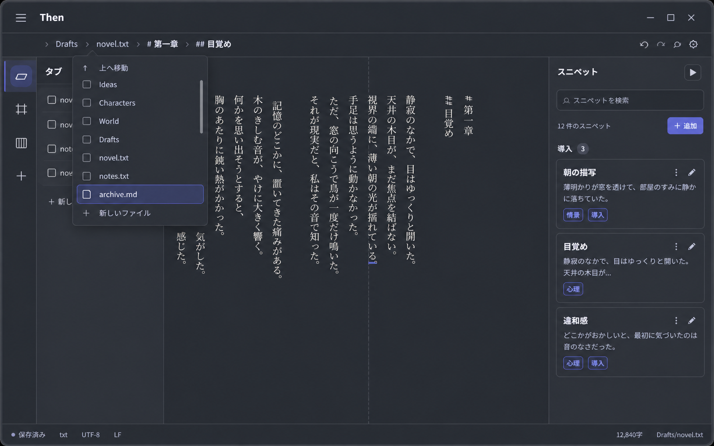

# Aero Glass / Soft Flat theme mockups

Then の現行レイアウトを固定し、テーマの素材感を比較するために作成したモックアップ。
現在は Aero Glass を新規テーマとして追加し、既存の Flat を Soft Flat の仕様へ更新済み。
内部テーマIDは既存設定との互換性を保つため `acrylic-*` のまま維持する。

## Aero Glass (Glassmorphism)

| Light | Dark |
| --- | --- |
|  |  |

- 鮮やかな空色／夜色の背景に、半透明フロスト、白いリム、奥行きのある影を重ねる。
- 通常コントロールは `9px`、主要ガラスパネルは `14px`。
- 本文・行番号・現在行ハイライトはガラス面と独立した座標レイヤーに置く。
- 掲載PNGは最初の方向確認用。実装版は Glassmorphism を強めている。

### Proposed semantic tokens

| Token | Aero Glass Light | Aero Glass Dark |
| --- | --- | --- |
| `--bg-root` | `#b9d9ec` | `#06141f` |
| `--bg-primary` | `rgba(248, 253, 255, 0.80)` | `rgba(9, 25, 38, 0.80)` |
| `--bg-secondary` | `rgba(226, 242, 251, 0.68)` | `rgba(16, 43, 59, 0.66)` |
| `--bg-panel` | `rgba(237, 249, 255, 0.58)` | `rgba(10, 39, 55, 0.56)` |
| `--bg-panel-strong` | `rgba(250, 254, 255, 0.90)` | `rgba(16, 45, 61, 0.90)` |
| `--text-primary` | `#10273f` | `#f1f5fb` |
| `--text-secondary` | `#3f5b74` | `#c5cfdd` |
| `--text-muted` | `#657f96` | `#8e9db2` |
| `--border-subtle` | `rgba(255, 255, 255, 0.56)` | `rgba(174, 230, 251, 0.20)` |
| `--border-strong` | `rgba(38, 105, 148, 0.40)` | `rgba(174, 230, 251, 0.40)` |
| `--accent` | `#1688ca` | `#26a9e6` |
| `--accent-strong` | `#0867a5` | `#75d5f7` |
| `--focus-ring` | `#087cc1` | `#55c7f1` |
| `--success` | `#27835a` | `#62c796` |
| `--warning` | `#9b6a18` | `#e0b45e` |
| `--danger` | `#bd4b55` | `#f1848d` |
| `--radius-control` | `9px` | `9px` |
| `--radius-card` | `14px` | `14px` |
| `--panel-blur` | `blur(24px) saturate(165%)` | `blur(26px) saturate(155%)` |

## Soft Flat

| Light | Dark |
| --- | --- |
|  |  |

- 完全に不透明な面、細い境界線、最小限の影で階層を作る。
- 通常コントロールは `10px`、カードは `14px`、ポップオーバーは `16px`。
- 選択状態は淡い青の塗りと境界線を併用し、色だけに依存しない。

### Proposed semantic tokens

| Token | Soft Flat Light | Soft Flat Dark |
| --- | --- | --- |
| `--bg-root` | `#f4f2ee` | `#20252d` |
| `--bg-primary` | `#fbfaf8` | `#262c35` |
| `--bg-secondary` | `#f1efeb` | `#2c333d` |
| `--bg-panel` | `#ffffff` | `#2a3039` |
| `--bg-panel-strong` | `#ffffff` | `#323944` |
| `--text-primary` | `#17243a` | `#f2f4f7` |
| `--text-secondary` | `#46546a` | `#cbd1da` |
| `--text-muted` | `#737e8e` | `#979fac` |
| `--border-subtle` | `#dedbd5` | `#414955` |
| `--border-strong` | `#c7c3bc` | `#596270` |
| `--accent` | `#3f82e6` | `#716fe7` |
| `--accent-strong` | `#2867c2` | `#9794ff` |
| `--focus-ring` | `#2f73d5` | `#8d8aff` |
| `--success` | `#2d805a` | `#70c69a` |
| `--warning` | `#946719` | `#dbb15c` |
| `--danger` | `#b84952` | `#ee828c` |
| `--radius-control` | `10px` | `10px` |
| `--radius-card` | `14px` | `14px` |
| `--panel-blur` | `none` | `none` |

## Shared implementation notes

- 日本語本文は既存の明朝体を維持し、UI は Noto Sans JP 系のフォールバックを使う。
- 本文には字間調整をかけず、UI 見出しだけ必要に応じて `font-feature-settings: "palt"` を使う。
- Aero Glass は Windows WebView の `backdrop-filter` 対応を確認し、無効時は `--bg-panel-strong` にフォールバックする。
- 行番号・改行記号・現在行ハイライトはスクローラー外の絶対配置レイヤーとし、フィルターによる包含ブロック変更の影響を受けない。
- 主要フォーカスは 2px リングと形状変化を併用する。成功・警告・危険はアイコンまたは文言を必ず添える。

## Implementation status

- `acrylic-light` / `acrylic-dark`: 表示名 Aero Glass としてテーマ選択へ追加済み。
- `flat-light` / `flat-dark`: Soft Flat の不透明面・角丸・単色アクセントへ更新済み。
- テーマ選択プレビュー、永続化対象の型、CSS 読み込み、テーマ回帰テストを更新済み。
- Vite の実画面で Aero Glass のライト／ダークを切り替え、複数行の行番号・現在行ハイライトの原点と領域一致を確認済み。

## Image generation prompts

Built-in ImageGen を使用。共通して現行の `docs/then-ui-mockup-v2.png` を編集対象とし、レイアウト、情報構造、文面、縦書きエディタを固定した。

- Aero Glass Light: vivid sky wallpaper, frosted cyan-white panels, bright glass rim, deep soft shadow, 9px/14px radii.
- Aero Glass Dark: deep teal-night wallpaper, smoky cyan glass, cool rim highlight, deep soft shadow, 9px/14px radii.
- Soft Flat Light: opaque warm off-white surfaces, stone-gray hierarchy, cornflower accent, no blur or gradients, 10px/14px/16px radii.
- Soft Flat Dark: opaque blue-charcoal surface ladder, off-white text, periwinkle accent, no blur or gradients, 10px/14px/16px radii.

すべてに `change only the theme styling; keep geometry, information architecture, content density, and all panels unchanged` を制約として指定した。
